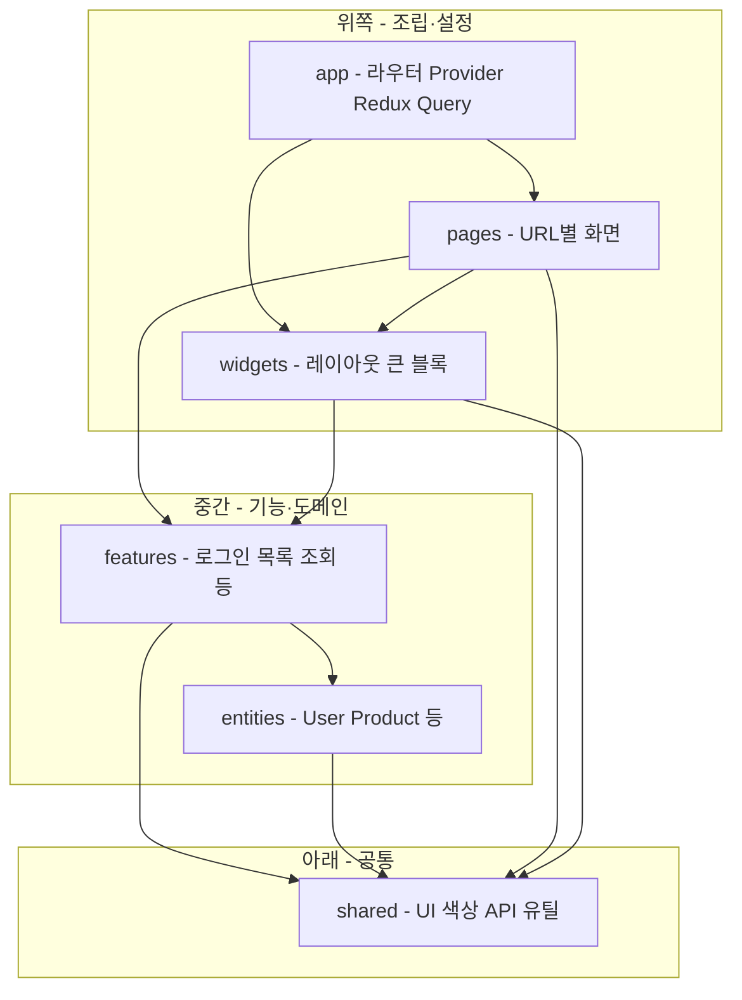

# React Template

다른 React 프로젝트를 시작할 때 **이 저장소를 복사**해서 바로 개발할 수 있도록 만든 **JavaScript(JS)** 기반 템플릿입니다.

- **언어**: JavaScript (`.js` / `.jsx`) — TypeScript 미사용
- **빌드**: [Create React App](https://github.com/facebook/create-react-app) (CRA)
- **아키텍처**: [Feature-Sliced Design (FSD)](https://feature-sliced.design/docs/get-started/overview)

> **현재 구현 상태**: CRA 기본 프로젝트가 생성된 상태입니다. 아래에 정리한 라우팅, React Query, Redux, Tailwind, FSD 폴더 등은 템플릿 **목표 구성**이며, 단계적으로 채워 나갑니다.

---

## 목차

1. [이 템플릿으로 할 수 있는 것](#이-템플릿으로-할-수-있는-것)
2. [새 프로젝트 시작하기](#새-프로젝트-시작하기)
3. [기술 스택 로드맵](#기술-스택-로드맵)
4. [상태 관리: Redux vs React Query](#상태-관리-redux-vs-react-query)
5. [팀 코딩 규칙 (화면 / 기능 / 로직 이름)](#팀-코딩-규칙-화면--기능--로직-이름)
6. [FSD란? — 처음 보는 분을 위한 상세 설명](#fsd란--처음-보는-분을-위한-상세-설명)
7. [폴더 구조 전체 (JavaScript)](#폴더-구조-전체-javascript)
8. [파일 확장자 규칙](#파일-확장자-규칙)
9. [경로 별칭 (Path Alias)](#경로-별칭-path-alias)
10. [import 규칙 — 폴더 간 연결 규칙](#import-규칙--폴더-간-연결-규칙)
11. [새 화면 추가하는 방법](#새-화면-추가하는-방법)
12. [스타일 · 아이콘 · 색상 · 폰트](#스타일--아이콘--색상--폰트)
13. [개발 규칙 (ESLint · Cursor)](#개발-규칙-eslint--cursor)
14. [실행 명령어](#실행-명령어)
15. [참고 링크](#참고-링크)

---

## 이 템플릿으로 할 수 있는 것

| 목적          | 설명                                                               |
| ------------- | ------------------------------------------------------------------ |
| **빠른 시작** | 매번 CRA부터 설정하지 않고, 라우팅·상태·폴더 규칙이 잡힌 채로 시작 |
| **구조 통일** | 화면·기능·공통 UI가 항상 같은 위치에 있어 팀원이 파일을 찾기 쉬움  |
| **규칙 공유** | ESLint 설정, Cursor Rule로 AI·린터가 같은 스타일을 따름            |

---

## 새 프로젝트 시작하기

1. 이 저장소를 **복사**하거나 `Use this template` / `git clone`으로 가져옵니다.
2. 프로젝트 이름에 맞게 `package.json`의 `name`을 수정합니다.
3. `.env.example`을 복사해 `.env`를 만들고 API 주소 등을 채웁니다. (추가 예정)
4. `npm install` 후 `npm start`로 실행합니다.
5. CRA 기본 데모 파일(`App.js`, `logo.svg` 등)은 `app/` · `pages/` 구조로 **교체**합니다. (구현 시 README 체크리스트 참고)
6. 새 기능은 [새 화면 추가하는 방법](#새-화면-추가하는-방법)을 따릅니다.

---

## 기술 스택 로드맵

템플릿에 단계적으로 넣을 기술입니다.

### Step 1 — 빌드

| 항목      | 선택                                               |
| --------- | -------------------------------------------------- |
| 빌드 도구 | Create React App (`react-scripts`) — **이미 적용** |
| SSR       | **적용하지 않음** (CRA는 클라이언트 렌더링 중심)   |

### Step 2 — 앱 골격

| 항목                             | 역할                                           |
| -------------------------------- | ---------------------------------------------- |
| **React Router**                 | URL에 따라 다른 화면(페이지) 표시              |
| **TanStack Query (React Query)** | 서버 API 데이터, 로딩/에러 표시, 캐시, refetch |
| **React.lazy**                   | 화면별 코드 분할 — 처음에 필요한 JS만 로드     |
| **SSR**                          | 미적용                                         |

### Step 3 — 클라이언트 전역 상태

| 항목              | Redux에 둘 것                                    |
| ----------------- | ------------------------------------------------ |
| **Redux Toolkit** | 로그인한 사용자 정보                             |
|                   | UI 전역 (사이드바 열림/닫힘, 테마)               |
|                   | 여러 화면이 **동시에** 써야 하는 클라이언트 상태 |

서버에서 받아온 목록·상세 데이터는 **React Query**에 둡니다. ([상태 관리](#상태-관리-redux-vs-react-query) 참고)

### Step 4 — 스타일

| 항목             | 규칙                                                                             |
| ---------------- | -------------------------------------------------------------------------------- |
| **Tailwind CSS** | 유틸리티 클래스 기반 스타일                                                      |
| **아이콘**       | Heroicons / Lucide 등 라이브러리 사용, **`shared/config/icons.js`에서만** import |
| **색상**         | Tailwind `theme` 확장, **`shared/config/colors.js`에서만** 정의                  |
| **폰트**         | **`shared/config/fonts.js`** + `tailwind.config.js` 연동                         |

> Tailwind는 **아이콘 세트를 제공하지 않습니다**. “아이콘은 Tailwind에서”가 아니라 **아이콘 라이브러리 + 중앙 관리 파일**을 의미합니다.

### Step 5 — UI · 폴더

| 항목              | 내용                                                            |
| ----------------- | --------------------------------------------------------------- |
| **기초 컴포넌트** | Input, Textarea, Select, Dialog, Bottom Sheet 등 → `shared/ui/` |
| **폴더 구조**     | FSD (아래 [상세 설명](#fsd란--처음-보는-분을-위한-상세-설명))   |

### Step 6 — 개발 규칙

| 항목             | 내용                                                                     |
| ---------------- | ------------------------------------------------------------------------ |
| **ESLint**       | `.eslintrc` 등 **설정 파일을 저장소에 포함** — 새 프로젝트에 그대로 복사 |
| **Prettier**     | (권장) ESLint와 함께 포맷 통일                                           |
| **Cursor Rules** | `.cursor/rules` — FSD, 네이밍, Query/Redux 역할을 AI에게 안내            |

---

## 상태 관리: Redux vs React Query

코딩을 모르셔도 아래 표만 기억하시면 됩니다.

| 데이터 종류               | 예시                              | 어디에?                |
| ------------------------- | --------------------------------- | ---------------------- |
| **서버 데이터**           | 회원 목록, 게시글, API 조회 결과  | **React Query**        |
| **화면에만 잠깐 쓰는 UI** | 모달 열림, 입력 중인 검색어       | 컴포넌트 안 `useState` |
| **앱 전체가 공유**        | 로그인 사용자, 다크모드, 사이드바 | **Redux**              |

**왜 나누나요?**  
서버 데이터는 “가져오기·캐시·다시 불러오기”가 React Query에 맞고, 로그인 사용자처럼 **여러 화면이 같은 값을 봐야 할 때** Redux가 맞습니다.

---

## 팀 코딩 규칙 (화면 / 기능 / 로직 이름)

이 템플릿은 **화면단**과 **기능단**을 나누고, 함수 이름 규칙을 통일합니다.

| 구분           | 의미                         | 폴더 위치                | 파일 예시                         |
| -------------- | ---------------------------- | ------------------------ | --------------------------------- |
| **화면**       | 사용자가 보는 한 페이지 전체 | `pages/<이름>/ui/`       | `SampleListPage.jsx`              |
| **기능(로직)** | 조회·저장·버튼 처리 등 동작  | `features/<이름>/model/` | `SampleListF.js`                  |
| **조회 로직**  | 목록/상세 검색               | `*F.js` 안               | `SearchLogic1`, `SearchLogic2`, … |
| **저장 로직**  | 등록·수정·삭제               | `*F.js` 안               | `SaveLogic1`, `SaveLogic2`, …     |

**함수 이름**: 파스칼 케이스 (예: `SearchLogic1`, `SaveLogic1`)

**흐름 (한 줄)**  
브라우저 주소 → **페이지(화면)** 가 레이아웃을 붙이고 → **기능(표·폼)** 을 보여 주며 → **기능단 JS** 가 조회/저장을 실행합니다.

---

## FSD란? — 처음 보는 분을 위한 상세 설명

### 한 문장 정의

**FSD(Feature-Sliced Design)** 는 “웹 앱의 파일을 **역할별 층(레이어)** 과 **기능별 상자(슬라이스)** 로 나누는 설계 방법”입니다.

공식 문서: [Feature-Sliced Design — Get started](https://feature-sliced.design/docs/get-started/overview)

---

### 왜 폴더를 나누나요? (비유: 회사 건물)

웹 앱을 **한 층짜리 창고에 모든 물건을 쌓아 두는 것**에 비유해 보겠습니다.

- 로그인 버튼 코드
- 메인 화면 코드
- API 주소 설정
- 빨간색 버튼 디자인
- 사이드바 코드

이게 전부 `src` 한 폴더에 섞이면:

- “로그인 버튼 색만 바꾸고 싶은데 어디 있지?” → 찾기 어렵습니다.
- 새 사람이 합류하면 **파일 이름만 보고는 역할을 모릅니다**.
- 화면 A가 화면 B 코드를 직접 건드리면, B를 수정할 때 A도 깨질 수 있습니다.

FSD는 건물을 **층(레이어)** 으로 나눕니다.

| 층 이름      | 비유                       | 하는 일                                                     |
| ------------ | -------------------------- | ----------------------------------------------------------- |
| **app**      | 건물 로비·전기·엘리베이터  | 앱 전체 설정: 라우터, Redux, React Query Provider           |
| **pages**    | “로그인 층”, “목록 층”     | **주소(URL) 하나 = 화면 하나**                              |
| **widgets**  | 로비에 있는 큰 안내 데스크 | 여러 기능을 **묶은 큰 UI** (전체 레이아웃, 사이드바+헤더)   |
| **features** | 각 부서 창구               | **사용자 행동** 단위 (로그인하기, 목록 조회하기)            |
| **entities** | 회사 공통 명함·직원 카드   | **업무 데이터 단위** (사용자, 상품) — 여러 창구가 공유      |
| **shared**   | 공용 복사기·도장·A4용지    | **어떤 프로젝트에나 쓸 수 있는** 버튼, 색상, API 클라이언트 |

**중요한 규칙**: 위층(앱·페이지)은 아래층(shared)을 **가져다 쓸 수** 있지만, 아래층이 위층을 가져다 쓰면 **안 됩니다**. (엘리베이터가 로비 전기를 쓰는 것은 OK, 복사기가 “3층 회의실 전용 코드”를 알면 안 됨)

---

### “슬라이스(Slice)”란? (비유: 같은 층의 칸막이 서랍)

한 층 안에도 기능마다 **서랍(폴더)** 을 둡니다.

예: `features` 층 안에

- `auth` 서랍 → 로그인 관련만
- `sample-list` 서랍 → 샘플 목록 관련만

이 **서랍 하나 = 슬라이스** 입니다.  
이름은 보통 **영문 kebab-case** (`sample-list`, `ui-preferences`).

**같은 층의 서랍끼리는 직접 물건을 빌려오지 않습니다.**  
로그인 서랍이 목록 서랍 파일을 직접 import 하면 안 됩니다. 공통이 필요하면 **아래층 `entities`나 `shared`** 로 내립니다.

---

### 슬라이스 안의 “칸” (세그먼트)

각 서랍 안은 다시 **역할별 칸**으로 나눕니다.

| 칸 이름   | 들어가는 것                        | 비유                        |
| --------- | ---------------------------------- | --------------------------- |
| **ui**    | 화면에 보이는 버튼·표·폼           | 창구 앞에 보이는 키오스크   |
| **model** | 상태, 훅, `SearchLogic1` 같은 로직 | 창구 뒤에서 일하는 직원     |
| **api**   | 서버 주소 호출, fetch/axios        | 창구와 본사를 연결하는 전화 |
| **lib**   | (선택) 이 기능만 쓰는 계산·포맷    | 창구 전용 계산기            |

**팀 규칙과 연결**

- 화면 파일 (`SampleListPage.jsx`) → 보통 **`pages/.../ui`**
- 기능단 (`SampleListF.js`, `SearchLogic1`) → **`features/.../model`**

---

### 데이터가 흐르는 순서 (로그인 후 목록 보기)

아래는 “사용자가 `/sample-list` 주소로 들어왔을 때”를 **위에서 아래로**만 읽으면 됩니다.

```
1. app (로비)
   → “어떤 주소면 어떤 페이지를 보여 줄지” 라우터가 결정

2. pages/sample-list (목록 층)
   → SampleListPage.jsx: “이 화면의 큰 틀”만 조립

3. widgets/layout (레이아웃 데스크)
   → MainLayout: 사이드바 + 위쪽 바 + 가운데에 내용 넣는 틀

4. features/sample-list (목록 창구)
   → ui: 표, 버튼
   → model: SearchLogic1으로 조회, 버튼 클릭 처리
   → api: 실제 HTTP 요청

5. entities/sample (공통 명함) — 필요할 때만
   → “샘플 한 건”이 어떤 필드를 갖는지, 여러 기능이 같이 씀

6. shared (공용 창고)
   → Button, Input, API 기본 주소, 색상·아이콘 설정
```

**React Query**는 보통 `features/.../model`의 훅에서 “서버에서 목록 가져오기”에 쓰고,  
**Redux**는 `features/auth`, `features/ui-preferences`처럼 “로그인 사용자·테마”에 씁니다.

---

### 레이어별로 “이것만 넣으세요” 체크리스트

#### `app` — 앱 전체

- React 앱을 브라우저에 올리는 시작점 (`App.jsx`)
- `Router`, `QueryClientProvider`, `Provider`(Redux) 한곳에 모음
- 전역 CSS (`@tailwind` 등)

**넣지 말 것**: 특정 화면 전용 표, “게시글 목록 테이블” 같은 것

---

#### `pages` — URL과 1:1 화면

- `/login` → `LoginPage.jsx`
- `/home` → `HomePage.jsx`

**역할**: 여러 `features`·`widgets`를 **레고처럼 조립**만 함.  
무거운 조회/저장 코드는 `pages`에 길게 쓰지 않고 `features/.../model`로 보냅니다.

---

#### `widgets` — 여러 기능을 묶은 큰 UI

- `MainLayout` (사이드바 + 헤더 + `{자식}` 영역)
- 대시보드의 “상단 3개 카드 묶음”처럼 **페이지보다 크고, feature보다 큰 덩어리**

작은 프로젝트면 `widgets`가 거의 없을 수 있고, 레이아웃 하나만 있어도 됩니다.

---

#### `features` — 사용자 시나리오

- “로그인한다”
- “샘플 목록을 조회한다”
- “사이드바를 연다/닫는다” (UI 전역이면 Redux slice도 여기 `model`)

**가장 자주 코드를 추가하는 층**입니다.

---

#### `entities` — 업무 도메인

- `user`, `product`, `sample` 처럼 **비즈니스 객체** 단위
- 처음에는 `features` 안에 두었다가, **두 번째 기능에서도 같은 user를 쓰면** `entities/user`로 올립니다.

---

#### `shared` — 비즈니스와 무관한 공통

- 버튼, 입력창, 다이얼로그
- `colors.js`, `icons.js`, `fonts.js`
- API `client.js` (기본 URL, 헤더)

**어떤 회사 프로젝트에도 그대로 가져갈 수 있는 것**만 둡니다.

---

### FSD를 지키지 않으면 생기는 일

| 잘못된 예                               | 결과                                                     |
| --------------------------------------- | -------------------------------------------------------- |
| `shared`에서 `pages/login` import       | 공용 복사기가 “로그인 층 전용 코드”에 묶임 → 재사용 불가 |
| `features/A`가 `features/B` 직접 import | 창구끼리 엮임 → B 수정 시 A도 수정                       |
| 모든 코드를 `pages` 한곳에              | 화면이 커질수록 파일 수천 줄, 신규 인원 온보딩 어려움    |

템플릿에서는 **ESLint `import/no-restricted-paths`** 로 위 규칙을 자동 검사하는 것을 권장합니다.

---

### `index.js` — 서랍 문에 붙이는 “메뉴판”

각 슬라이스 폴더 루트의 `index.js`는 **바깥에 공개할 것만** export 합니다.

```js
// features/sample-list/index.js
export { SampleListTable } from './ui/SampleListTable.jsx';
export { useSampleListPage, SearchLogic1 } from './model/SampleListF.js';
```

다른 폴더에서는 **내부 파일 경로를 직접 쓰지 않고** `@/features/sample-list`처럼 **메뉴판만** import 합니다.  
그래야 나중에 파일 이름을 바꿔도 바깥 코드가 덜 깨집니다.

---

### FSD 다이어그램 (레이어 관계)



**화살표 방향**: 위에서 아래로만 의존합니다. `shared` → `pages` 같은 역방향은 금지.

---

### 더 읽을 거리 (한국어·영문)

- [Feature-Sliced Design 공식 — Overview](https://feature-sliced.design/docs/get-started/overview)
- [FSD 개념 정리 (블로그)](https://wonderfulwonder.tistory.com/110)
- [React 폴더 구조 관련 글](https://joong-sunny.github.io/react/react7/)

---

## 폴더 구조 전체 (JavaScript)

아래는 템플릿 **완성 목표** 트리입니다. `src/` 아래 기준입니다.

```text
src/
├── app/                              # 앱 전체 설정
│   ├── App.jsx
│   ├── providers/
│   │   ├── AppProviders.jsx          # Query + Redux + Router
│   │   ├── QueryProvider.jsx
│   │   └── StoreProvider.jsx
│   ├── router/
│   │   ├── index.jsx
│   │   ├── routes.jsx
│   │   ├── PrivateRoute.jsx          # (선택) 로그인 필요 라우트
│   │   └── lazyPages.js              # React.lazy 페이지 모음
│   ├── store/
│   │   ├── index.js
│   │   ├── hooks.js                  # useAppDispatch, useAppSelector
│   │   └── rootReducer.js
│   └── styles/
│       └── globals.css
│
├── pages/                            # URL 1개 = 화면 1개 (화면단)
│   ├── home/
│   │   ├── ui/
│   │   │   └── HomePage.jsx
│   │   └── index.js
│   ├── login/
│   │   ├── ui/
│   │   │   └── LoginPage.jsx
│   │   └── index.js
│   └── sample-list/
│       ├── ui/
│       │   └── SampleListPage.jsx
│       └── index.js
│
├── widgets/                          # 큰 UI 조각 (레이아웃 등)
│   ├── layout/
│   │   ├── ui/
│   │   │   ├── MainLayout.jsx
│   │   │   └── AuthLayout.jsx
│   │   └── index.js
│   └── sidebar/
│       ├── ui/
│       │   └── AppSidebar.jsx
│       └── index.js
│
├── features/                         # 기능·시나리오 (기능단)
│   ├── auth/
│   │   ├── api/
│   │   │   └── authApi.js
│   │   ├── model/
│   │   │   ├── authSlice.js          # Redux: 로그인 사용자
│   │   │   ├── useAuth.js
│   │   │   └── LoginF.js             # SaveLogic1 등
│   │   ├── ui/
│   │   │   └── LoginForm.jsx
│   │   └── index.js
│   ├── sample-list/
│   │   ├── api/
│   │   │   └── sampleListApi.js
│   │   ├── model/
│   │   │   ├── useSampleListQuery.js
│   │   │   └── SampleListF.js        # SearchLogic1, SaveLogic1
│   │   ├── ui/
│   │   │   └── SampleListTable.jsx
│   │   └── index.js
│   └── ui-preferences/
│       ├── model/
│       │   └── uiPreferencesSlice.js # 테마, 사이드바
│       └── index.js
│
├── entities/                         # 공유 도메인 (필요 시 추가)
│   ├── user/
│   │   ├── api/
│   │   │   └── userApi.js
│   │   ├── model/
│   │   │   └── userTypes.js          # (선택) JSDoc typedef
│   │   └── index.js
│   └── sample/
│       ├── model/
│       │   └── sampleTypes.js
│       └── index.js
│
├── shared/                           # 전역 공통
│   ├── api/
│   │   ├── client.js
│   │   └── queryClient.js
│   ├── config/
│   │   ├── env.js
│   │   ├── colors.js
│   │   ├── fonts.js
│   │   └── icons.js
│   ├── ui/
│   │   ├── button/
│   │   ├── input/
│   │   ├── textarea/
│   │   ├── select/
│   │   ├── dialog/
│   │   ├── bottom-sheet/
│   │   └── index.js
│   ├── lib/
│   │   ├── cn.js
│   │   └── formatDate.js
│   └── constants/
│       └── queryKeys.js
│
├── index.js
└── setupTests.js
```

프로젝트 루트 예시:

```text
├── public/
├── src/
├── tailwind.config.js
├── postcss.config.js
├── jsconfig.json                     # 에디터용 path alias
├── .eslintrc.cjs
├── .env.example
└── package.json
```

---

## 파일 확장자 규칙

| 종류                           | 확장자                   | 예                               |
| ------------------------------ | ------------------------ | -------------------------------- |
| React 화면·컴포넌트 (JSX 있음) | `.jsx`                   | `HomePage.jsx`, `Button.jsx`     |
| 로직·API·slice·설정            | `.js`                    | `SampleListF.js`, `authSlice.js` |
| 전역 스타일                    | `.css`                   | `globals.css`                    |
| 테스트                         | `.test.js` / `.test.jsx` | `Button.test.jsx`                |

---

## 경로 별칭 (Path Alias)

`jsconfig.json` (에디터 자동완성) 예시:

```json
{
  "compilerOptions": {
    "baseUrl": "src",
    "paths": {
      "@/app/*": ["app/*"],
      "@/pages/*": ["pages/*"],
      "@/widgets/*": ["widgets/*"],
      "@/features/*": ["features/*"],
      "@/entities/*": ["entities/*"],
      "@/shared/*": ["shared/*"]
    }
  },
  "include": ["src"]
}
```

실제 빌드에서도 동일 alias를 쓰려면 CRA에서는 **CRACO** 등으로 webpack alias를 맞춰야 합니다.

사용 예:

```js
import { Button } from '@/shared/ui';
import { useSampleListPage } from '@/features/sample-list';
```

---

## import 규칙 — 폴더 간 연결 규칙

| 내 레이어  | import 가능한 레이어                       |
| ---------- | ------------------------------------------ |
| `app`      | pages, widgets, features, entities, shared |
| `pages`    | widgets, features, entities, shared        |
| `widgets`  | features, entities, shared                 |
| `features` | entities, shared                           |
| `entities` | shared                                     |
| `shared`   | **shared만**                               |

**금지**

- `features/로그인` → `features/목록` 직접 import
- `shared` → `pages` / `features` import
- `pages/A` → `pages/B` import (공통은 `widgets` / `features` / `shared`로)

---

## 새 화면 추가하는 방법

예: “샘플 목록” 화면 `/sample-list` 추가

### 1단계 — 페이지(화면) 만들기

1. `src/pages/sample-list/ui/SampleListPage.jsx` 생성
2. `src/pages/sample-list/index.js`에서 export
3. `app/router/routes.jsx`에 경로 등록
4. 필요 시 `app/router/lazyPages.js`에 `React.lazy` 등록

### 2단계 — 기능(로직·UI) 만들기

1. `src/features/sample-list/model/SampleListF.js` — `SearchLogic1`, `SaveLogic1`
2. `src/features/sample-list/api/sampleListApi.js` — HTTP
3. `src/features/sample-list/ui/SampleListTable.jsx` — 표/버튼
4. `src/features/sample-list/index.js` — public export

### 3단계 — 페이지에서 조립

`SampleListPage.jsx`에서는 레이아웃(`widgets/layout`) + 기능 UI + `useSampleListPage()` 훅만 연결합니다.

### 4단계 — 같은 데이터를 다른 화면에서도 쓸 때

“사용자(user)” 정보가 로그인·마이페이지·관리자에서 모두 필요 → `entities/user`로 올립니다.

---

## 스타일 · 아이콘 · 색상 · 폰트

| 항목        | 파일                      | 규칙                                                    |
| ----------- | ------------------------- | ------------------------------------------------------- |
| 색상        | `shared/config/colors.js` | `tailwind.config.js`의 `theme.extend.colors`에서 import |
| 폰트        | `shared/config/fonts.js`  | 동일하게 theme 연동                                     |
| 아이콘      | `shared/config/icons.js`  | Lucide/Heroicons 등을 여기서만 re-export                |
| UI 컴포넌트 | `shared/ui/*`             | Input, Dialog 등 — 비즈니스 문구는 `features` 쪽에서    |

컴포넌트 파일 안에서 아이콘·색상 hex를 **직접 하드코딩하지 않습니다.**

---

## 개발 규칙 (ESLint · Cursor)

| 도구                               | 목적                                                                           |
| ---------------------------------- | ------------------------------------------------------------------------------ |
| **ESLint**                         | 문법·import 규칙·실수 방지 — 설정 파일을 repo에 포함해 새 프로젝트에 복사      |
| **Prettier**                       | 들여쓰기·따옴표 통일 (권장)                                                    |
| **Cursor Rules** (`.cursor/rules`) | FSD 레이어, `SearchLogicN` / `SaveLogicN`, 화면·기능 분리, Query vs Redux 안내 |

---

## 실행 명령어

프로젝트 루트에서:

| 명령어          | 설명                                                       |
| --------------- | ---------------------------------------------------------- |
| `npm start`     | 개발 서버 — [http://localhost:3000](http://localhost:3000) |
| `npm test`      | 테스트 (watch 모드)                                        |
| `npm run build` | 프로덕션 빌드 → `build/` 폴더                              |
| `npm run eject` | CRA 설정 추출 (**되돌릴 수 없음**, 가급적 사용 안 함)      |

---

## 참고 링크

| 주제                  | URL                                                     |
| --------------------- | ------------------------------------------------------- |
| Create React App      | https://github.com/facebook/create-react-app            |
| Feature-Sliced Design | https://feature-sliced.design/docs/get-started/overview |
| FSD (블로그)          | https://wonderfulwonder.tistory.com/110                 |
| React 폴더 구조       | https://joong-sunny.github.io/react/react7/             |
| React Router          | https://reactrouter.com/                                |
| TanStack Query        | https://tanstack.com/query/latest                       |
| Redux Toolkit         | https://redux-toolkit.js.org/                           |
| Tailwind CSS          | https://tailwindcss.com/docs                            |

---

## CRA 기본 파일 정리 (구조 적용 시)

FSD 구조로 옮길 때 제거·대체 대상:

| 제거/대체                           | 대신                                          |
| ----------------------------------- | --------------------------------------------- |
| `src/App.js`, `App.css`, `logo.svg` | `app/App.jsx`, `app/styles/globals.css`       |
| `src/index.js`                      | `AppProviders`로 감싼 뒤 `app/App.jsx` 마운트 |

---

## 라이선스 · 기여

사내/개인 템플릿 용도에 맞게 저장소 설정을 추가하세요.
